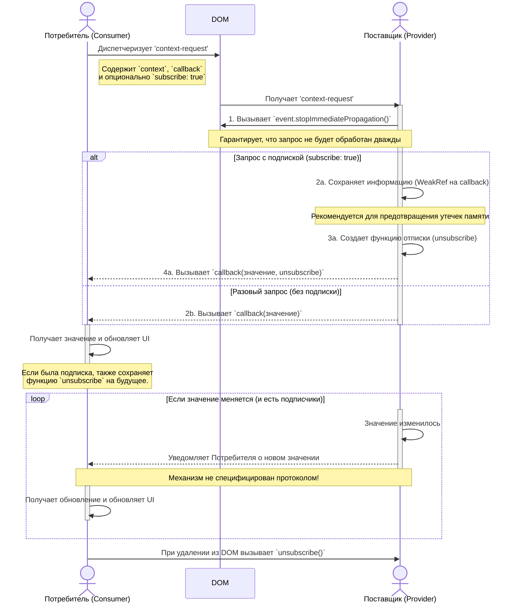

# Сниппеты кода для презентации

В данном документе представлены сниппеты кода, используемые в презентации.

## 00. Введение

```html
<div class="alert">
  <strong>Какое-то сообщение</strong>
  <button>Закрыть</button>
</div>
```

```js
$('.alert button').on('click', function () {
  $(this).parent().hide();
});
```

```html
<my-alert>
  <strong>Какое-то сообщение</strong>
</my-alert>
```

## 02. Что такое веб-компоненты?

### Custom Elements

```typescript
class MyElement extends HTMLElement {
  static observedAttributes = 'size';

  connectedCallback() {}

  disconnectedCallback() {}

  attributeChangedCallback(name, prev, curr) {}
}

customElements.define('my-element', MyElement);
```

```js
// JavaScript
const el = document.createElement('my-element');
el.setAttribute('size', '1');

document.body.appendChild(el);
```

```html
<!-- html -->
<body>
  <my-element size="1"><my-element>
</body>
```

### Shadow DOM

```js
const host = document.getElementById('host');
const shadow = host.attachShadow({ mode: 'open' });

const span = document.createElement('span');
span.textContent = 'Я внутри Shadow DOM';
shadow.appendChild(span);
```

### HTML Templates

```html
<div>
  <template shadowrootmode="open">
    <p>Абзац «скрыт» внутри Shadow DOM</p>
    <slot></slot>
  </template>

  <p>Абзац находится в Light DOM</p>
</div>
```

## 03. Миграция на Lit

### Инкапсуляция содержимого

```html
<body>
  <style>
    p {
      color: var(--yellow);
    }
  </style>

  <template shadowrootmode="open">
    <p>Абзац «скрыт» внутри Shadow DOM</p>
    <slot></slot>
  </template>

  <p>Абзац находится в Light DOM</p>
</body>
```

```html
<div id="host">
  <template shadowrootmode="open">
    <p></p>
  </template>
</div>

<script>
  document.querySelectorAll('p').length; // 0

  const root = window.host.shadowRoot;
  root.querySelectorAll('p').length; // 1
</script>
```

### Пишем селекторы по новому

```css
:host([variant='alt']) {
  --color: #000;
  --bg-color: #fff;
}
```

```html
<body>
  <acme-button>Кнопка</acme-button>
</body>
```

```html
<body>
  <acme-button variant="alt">Кнопка</acme-button>
</body>
```

### Атрибут part, слоты и CSS vars

```html
<body>
  <script type="module" src="./acme-button.js"></script>
  <acme-button>Кнопка</acme-button>
</body>
```

```ts
/**
 * @csspart button - тело кнопки
 * @cssprop [--color] - цвет текста
 * @cssprop [--bg-color] - цвет фона
 */
@customElement('acme-button')
class AcmeButton extends LitElement {
  protected override render() {
    return html`<button part="button">
      <slot name="icon"></slot>
      <slot></slot>
    </button>`;
  }
}
```

### Специальные селекторы

```html
<body>
  <style>
    acme-button::part(button) {
      box-shadow: 4px 4px 4px var(--yellow);
    }
  </style>
  <acme-button> Кнопка </acme-button>
</body>
```

```html
<body>
  <style>
    acme-button::part(button) {
      box-shadow: 4px 4px 4px var(--yellow);
    }
  </style>
  <acme-button>
    <span slot="icon">⭐</span>
    Кнопка
  </acme-button>
</body>
```

```css
::slotted([slot='icon']) {
  margin-right: 1rem;
}
```

### Слоты

```ts
render() {
  return repeat(
    range(3),
    (_, i) => i + counter,
    (_, i) => {
      const n = i + counter;
      return html`
        <div class="wrapper">
          <slot name="n-${n}">N</slot>
        </div>`;
    },
  );
}
```

```html
<my-swiper>
  <div slot="n-0">0</div>
  <div slot="n-1">1</div>
  <div slot="n-2">2</div>
  <!-- ... -->
</my-swiper>
```

```css
my-swiper:not(:defined) {
  display: flex;
  justify-content: space-between;
  color: #fff;
}
```

### Чрезмерная изоляция

```html
<body>
  <input type="checkbox" id="checkbox1" />
  <label for="checkbox1">Чекбокс 1</label>
  <div>
    <template shadowrootmode="open">
      <input type="checkbox" id="checkbox2" />
      <slot></slot>
    </template>
    <label for="checkbox2">Чекбокс 2</label>
  </div>
</body>
```

### Глобальные стили не работают

```html
<!doctype html>
<head>
  <link rel="stylesheet" href="./tw.css" />
</head>
<body>
  <template shadowrootmode="open">
    <div class="bg-sky-500 m-8">Hello, world</div>
  </template>
</body>
```

```ts
import sheet from './tw.css' with { type: 'css' };

const root = document.body.shadowRoot;
/* Поддержка с Safari 16.4 */
root.adoptedStyleSheets = [sheet];
```

```html
<!doctype html>
<head>
  <link rel="stylesheet" href="./tw.css" />
</head>
<body>
  <template shadowrootmode="open">
    <div class="bg-sky-500 m-8">Hello, world</div>
  </template>
  <script type="module" src="./index.js"></script>
</body>
```

### Затруднена работа с формами

```html
<body>
  <template shadowrootmode="open">
    <form id="form">
      <custom-input name="value"> </custom-input>
      <button type="submit">Отправить</button>
    </form>

    <pre id="output"></pre>
  </template>
</body>
```

```ts
@customElement('custom-input')
export class CustomInput extends LitElement {
  static styles = [sheet];

  @property() name!: string;

  render() {
    return html` <input name="${this.name}" type="text" /> `;
  }
}
```

```html
<body>
  <template shadowrootmode="open">
    <link rel="stylesheet" href="./custom-input.css" />
    <form id="form">
      <input name="value" />
      <button type="submit">Отправить</button>
    </form>

    <pre id="output"></pre>
  </template>
</body>
```

## 04. Экосистема Lit

### Управление состоянием

**[Context Protocol](https://github.com/webcomponents-cg/community-protocols/blob/main/proposals/context.md)**



```typescript
class StoreController implements ReactiveController {
  /* ... */
  hostConnected(): void {
    this.storeUnsubscribe = store.subscribe((state) => {
      this.state = state;
      this.host.requestUpdate();
    });
  }

  hostDisconnected(): void {
    this.storeUnsubscribe();
  }
}
```

```typescript
class UserProfile extends LitElement {
  private profileStore = new StoreController(
    this,
    { context: userStoreContext },
    (state) => state.profile,
  );

  render() {
    return html`<p>User name: ${this.profileStore.value.name}</p>`;
  }
}
```

### Реализация роутинга

```ts
class EddlCouponsApp extends LitElement {
  public router: Router = new Router(/* ... */);
  public route = new RouteController(
    this,
    { store: this.router },
    {
      'cps-index': () => html`<eddl-cps-index-page> </eddl-cps-index-page>`,
      'cps-campaign': ({ params }) =>
        html`<eddl-cps-coupon-page
          .couponId=${params.id}
        ></eddl-cps-coupon-page>`,
    },
  );
}
```

```ts
class EddlCouponsApp extends LitElement {
  public route = new RouteController(
    this,
    { store: this.router },
    {
      'cps-index': () => html`<eddl-cps-index-page> </eddl-cps-index-page>`,
      'cps-campaign': ({ params }) =>
        html`<eddl-cps-coupon-page
          .couponId=${params.id}
        ></eddl-cps-coupon-page>`,
    },
  );

  override render() {
    return html` <my-header></my-header>
      ${this.route.render()}
      <my-footer></my-footer>`;
  }
}
```

### Управления запросами

```typescript
class MyComponent extends LitElement {
  private query = new LitQuery(this, () => ({
    queryKey: ['todos'],
    queryFn: () => fetchTodos(),
  }));

  render() {
    return this.query.render({
      pending: () => html`Loading...`,
      error: (error) => html`Error: ${error.message}`,
      success: (data) => html`Data: ${data}`,
    });
  }
}
```

### Директивы

```typescript
async function asyncData() {
  await sleep(1000);

  return 'Data';
}

class MyComponent extends LitElement {
  render() {
    return html`
      <input
        .value=${until(asyncData(), 'Loading...')}
      ></input>
      <!-- ... -->
    `;
  }
}
```

### Директивы

```ts
class AcmeApp extends LitElement {
  async loadData() {
    return sleep(3000).then(() => 'Data');
  }

  render() {
    return html`<p>Current Time: ${now()}</p>
      <input
        .value=${until(
          this.loadData(),
          /* ... */
          delay(500, '..'),
          '.',
        )}
      />`;
  }
}
```

### KeepAlive

```ts
class EddlCouponsApp extends LitElement {
  public route = new RouteController(
    this,
    { store: this.router },
    {
      'cps-index': () => html`<eddl-cps-index-page> </eddl-cps-index-page>`,
      'cps-campaign': ({ params }) =>
        html`<eddl-cps-coupon-page
          .couponId=${params.id}
        ></eddl-cps-coupon-page>`,
    },
  );

  override render() {
    return html` <my-header></my-header>
      ${keepAlive(this.router.route.pathname, this.route.render(), { max: 20 })}
      <my-footer></my-footer>`;
  }
}
```
